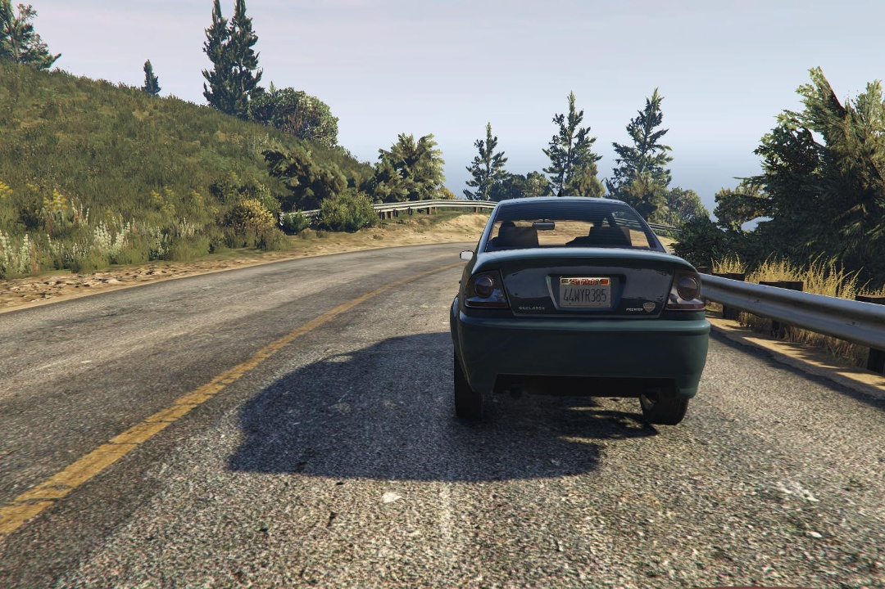
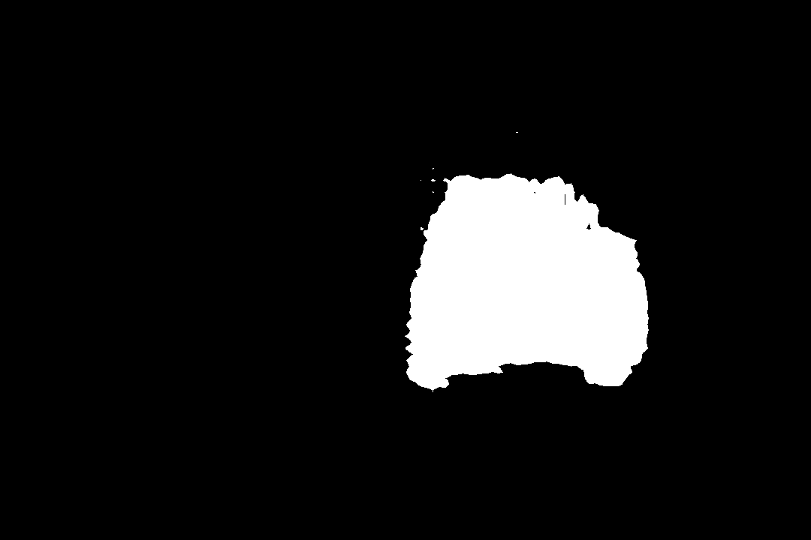

# Segmentation_network
This segmentation network is based on DeepLab network. It is finetuned to detect cars only. A CNN can be connected to it for
counting the numbe of cars in the image. The network currently is built for detecting the number of cars.

## Dataset
The dataset can be downloaded from https://fcav.engin.umich.edu/sim-dataset/ . The one used here is the 10K images dataset. THe trained checkpoint is also provided for further finetuning.

### Results after 3 epochs
The original image - 

The segmented image - 

Results can be improved by using more data (using the 200k dataset) and running the fine tuning for more epochs.
